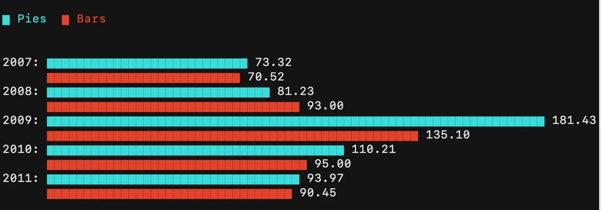
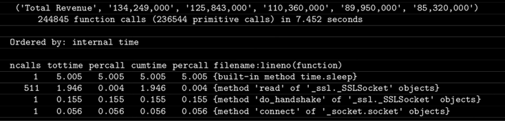

# Intro to Python: Package management and virtual environment

Summary: Today we will help you acquire basic knowledge about how to manage libraries in Python and work with virtual environments.

💡 [Tap here](https://new.oprosso.net/p/4cb31ec3f47a4596bc758ea1861fb624) **to leave your feedback on the project**. It's anonymous and will help our team make your educational experience better. We recommend completing the survey immediately after the project.

## Contents

1. [Chapter I](#chapter-i) \
    1.1. [Foreword](#foreword)
2. [Chapter II](#chapter-ii) \
    2.1. [Instructions](#instructions)
3. [Chapter III](#chapter-iii) \
    3.1. [Specific instructions for the day](#specific-instructions-for-the-day)
4. [Chapter IV](#chapter-iv) \
    4.1. [Exercise 00. Virtual Environment](#exercise-00-virtual-environment)
5. [Chapter V](#chapter-v) \
    5.1. [Exercise 01. Installing a package](#exercise-01-installing-a-package)
6. [Chapter VI](#chapter-vi) \
    6.1. [Exercise 02. Installing many libraries](#exercise-02-installing-many-libraries)
7. [Chapter VII](#chapter-vii) \
    7.1. [Exercise 03. Very beautiful soup](#exercise-03-very-beautiful-soup)
8. [Chapter VIII](#chapter-viii) \
    8.1. [Exercise 04. Profiling](#exercise-04-profiling)
9. [Chapter IX](#chapter-ix) \
    9.1. [Exercise 05. PyTest](#exercise-05-pytest)
    
   
## Chapter I

### Foreword

10 library rules:
* Use a level 0-1 voice.
* Use a shelf marker.
* Turn the pages from the top corner.
* Wash your hands before touching a book.
* Return books on time.
* Never eat or drink while reading.
* Keep books dry.
* Use a bookmark.
* Do not write or draw in books.
* Keep books away from babies and pets.

## Chapter II

### Instructions

* Use this page as your only reference. Do not pay attention to rumors or speculation about how to prepare your solution.
* Here and throughout, we use Python 3 as the only correct version of Python.
* The python files for python exercises (module01, module02, module03) must have the following block at the end: `if __name__ == ‘__main__’`.
* Pay attention to the permissions of your files and directories.
* To be assessed your solution must be in your GIT repository.
* Your solutions will be evaluated by your peers in the bootcamp.
* You should not leave any other files in your directory other than those explicitly specified in the exercise instructions. It is recommended that you modify your .gitignore to avoid any accidents.
* Your solution must be in your GIT repository for evaluation. Always push only to the develop branch! The master branch will be ignored. Work in the src directory.
* When you need to get precise output in your programs, it is forbidden to display a precalculated output instead of performing the exercise correctly.
* Have a question? Ask your neighbor on the right. If that fails, try your neighbor on the left.
* Your reference materials are your peers, the internet, and Google.
* Read the examples carefully. They may require information that is not specified elsewhere in the subject.
* May the Force be with you!

## Chapter III

### Specific instructions for the day

* No code in the global scope. Use functions!
* Each file must be ended by a function call in a condition similar to:
    ```python
    if __name__ == '__main__':
        # your tests and your error handling
    ```
* Any exception that goes uncaught will invalidate your work, even if it is an error that you were asked to test.
* No imports are allowed except those mentioned in the "Allowed Functions" section of each exercise's title block.

## Chapter IV

### Exercise 00. Virtual Environment

- Turn-in directory: `ex00/`.
- Files to turn in: `venv.py` and the folder with your virtual env.
- Allowed functions: `import os`.

**Libraries**, also known as **packages**, are one of the ways coding has become more accessible. It has never been easier to learn to code and quickly see results. Some programmers have written code that can be reused by others. Many of these Python libraries are open source, meaning everyone can use them. There is no need to write existing classes, methods, or functions from scratch because you can reuse them. All you need to do is run the command `sudo pip install`. Or wait...

This method of installing Python packages is considered poor practice. When you install them as described above, you install them in the system version of Python. Python exists on your machine not only to give you the power to code, but also to run essential system programs. Installing external packages like that may ruin your system. You almost never need to use sudo pip install.

A better way is to use **virtual environments**. Think of it as your own little sandbox where you can do whatever you want. If you mess something up, it only affects this sandbox. Your machine should have a package called `virtualenv` preinstalled. If not, contact the administrators or install it yourself if you are working on your personal computer. We will use it in the following exercises and projects.

This exercise is simple and just meant to warm you up and introduce you to the concept of virtual environments. What you need to do is:

1. Create a virtual environment with your nickname as the name using Python 3. You will work with this environment throughout the course.
2. Activate it.
3. Run Python 3 from the terminal.
4. Print the virtual environment name using the os library.
5. Write a small Python script that does this by calling it from the command line: 
    ```
    $ ./venv.py
    Your current virtual env is /Users/McShtuder/shtuder
    ```
6. Deactivate the environment.
7. Run the script again.

If you encounter a KeyError, a None value, or an exception while deactivating the environment, consider why it occurred. You don't need to fix it for this exercise, but be prepared to explain what happened.

## Chapter V

### Exercise 01. Installing a package

- Turn-in directory: `ex01/`.
- Files to turn in: `pies_bars.sh`, the file with the data and the folder with your virtual env from the previous exercise.
- Allowed functions: no restrictions.

Let us install the first package in your virtual environment! We will work with the `termgraph` library a bit. It allows you to draw graphs and diagrams directly in your terminal. What could be cooler?

1. Install the library in the virtual environment created in the previous exercise.
2. Make the same visualization as below, but with a different color scheme. Create a file for the visualization yourself.

    

3. Make a shell script file for this purpose named `pies_bars.sh`. It should only contain the part for making the graph, without the activation and deactivation of the env.

## Chapter VI

### Exercise 02. Installing many libraries

- Turn-in directory: `ex02/`.
- Files to turn in: `librarian.py` and the archive with your virtual env.
- Allowed functions: no restrictions.

During the following exercises, you will work with several different libraries. For this exercise, you need to prepare your virtual environment.

1. Install the latest releases of BeautifulSoup and PyTest. Installing them one by one (`pip install x; pip install y`) is prohibited. Using loops is also prohibited. Find a clever way to do it; use installation via requirements.
2. Write a Python script called librarian.py that:
- checks that it runs inside the correct env;
- installs the libraries;
- displays all the installed libraries at the end like this (it doesn't have to be an exact list):
    ```
    six==1.14.0
    soupsieve==2.0
    termgraph==0.2.0
    wcwidth==0.1.9
    zipp==3.1.0
    ```
- saves it to `requirements.txt`.
3. Place an archive of your environment in the folder. You can either put the archive in your code or do it from the command line. You can compress the archive if you think that would be useful. If the script was called from the wrong environment, an exception should be thrown.

## Chapter VII

### Exercise 03. Very beautiful soup

- Turn-in directory: `ex03/`.
- Files to turn in: `financial.py`.
- Allowed functions: no restrictions.

Okay, so you installed two libraries in the previous exercise. Now, let's work with one of them: **BeautifulSoup**. It's useful when you need to parse a website that doesn't have an API, as was the case with HeadHunter on Day 00. The problem is that when you parse a webpage, you get not only useful information, but also HTML markup, which can be difficult to work with. This package helps you navigate different HTML blocks and classes, making it easier to extract the information you need. Keep in mind, though, that it is not a parser itself; it just helps you navigate the HTML or XML mess (meaning that you need to install an HTTP library of your choice in your environment).

For this exercise, you will parse Yahoo Finance. Yes, it has an API, but for learning purposes, let's forget about that. Visit a [page like this](https://finance.yahoo.com/quote/msft/financials?p=msft) and get some data for a specific field of a specific company.

Write a Python script that:
- gets the ticker symbol and the field of the table as arguments (for example, MSFT, Total Revenue);
- returns the tuple containing the requested information;
- special conditions: add a "sleep for 5 seconds" inside your script (we will need it later).

The example:
```
$ ./financial.py 'MSFT' 'Total Revenue'
('Total Revenue', '134,249,000', '125,843,000', '110,360,000',
'89,950,000', '85,320,000')
```

If the URL does not exist, raise an exception. Do the same if the requested field does not exist.

## Chapter VIII

### Exercise 04. Profiling

- Turn-in directory: `ex04/`.
- Files to turn in: `financial.py`, `financial_enhanced.py`, `profiling-sleep.txt`, `profiling-tottime.txt`, `profiling-http.txt`, `profiling-ncalls.txt`.
- Allowed functions: no restrictions.

It's unlikely that you'll ever write code that's 100% perfect without room for improvement. You will likely need to determine why your scripts aren't working as quickly as you'd like. For such purposes, we have profilers. According to Wikipedia, profiling is a form of dynamic program analysis that measures the spatial or temporal complexity of a program, the usage of particular instructions, and the frequency and duration of function calls, among other things. Profiling information is most commonly used to optimize programs.

Remember your script from the previous exercise? Let's optimize it. Even if you are a programming guru, one of the structures was not very effective (we asked you to do it that way).

1. Apply cProfile to your `financial.py` script to get a table of the functions used, sorted in descending order by total execution time. Save it to the `profiling-sleep.txt` file.

    

2. Remove the line containing `time.sleep(5)` from your script, then run the profiling again. You should get a new table without the built-in method `time.sleep()`. Save it to the file `profiling-tottime.txt`.
3. Try using a different HTTP client library to see if your script runs faster. Save the new script as `financial_enhanced.py`. Save the profiling results to the file `profiling-http.txt`.
4. Get the same table, but sorted in descending order by number of calls. It is sometimes useful to know that you can choose to optimize those functions so that they are called fewer times. Save the table to `profiling-ncalls.txt`.
5. This time, use the `pstats` library. Sort by cumulative time and get the top five. Save it to the file `pstats-cumulative.txt`.

## Chapter IX

### Exercise 05. PyTest

- Turn-in directory: `ex05/`.
- Files to turn in: `financial_test.py`.
- Allowed functions: no restrictions.

The speed of your script is not the only issue to consider. It may not work as you intended from the start. To ensure that the script works properly, you need to conduct unit tests. For example, provide different inputs and verify that the outputs are as expected.

1. In ex03, we are sure that you used one or more functions. For each function, create at least three tests using the PyTest library. Check if your script provides the correct information for each request:
    - If I ask for Total Revenue, does it return the total revenue for the given ticker?
    - Is the return type a tuple?
    - If I enter an invalid ticker name, does an exception occur?
2. Add the tests to the code in your `financial.py` script. Save the file in your directory as `financial_test.py`. Run PyTest. Your tests should have passed. If not, work on your script to prepare it.
